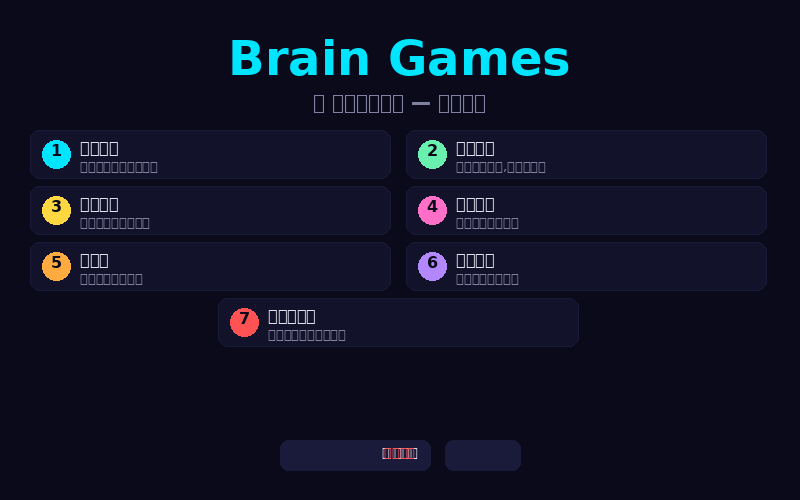
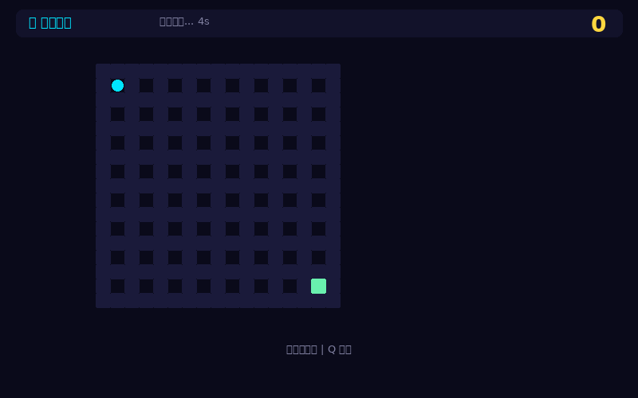
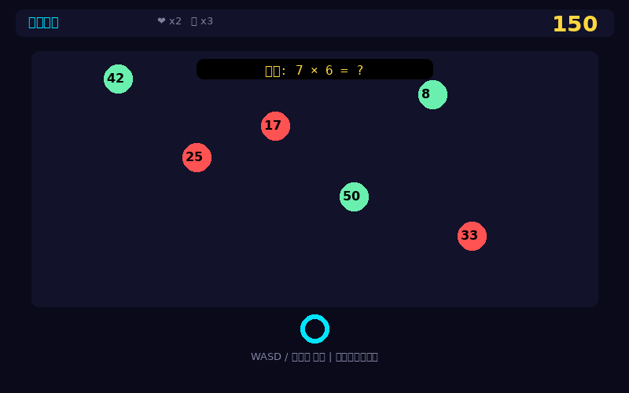
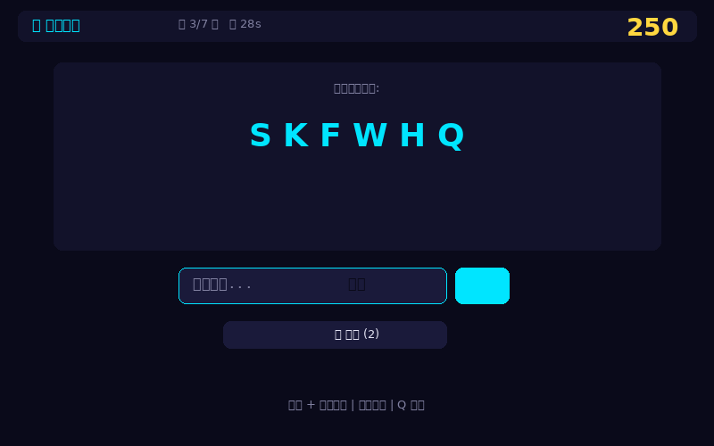
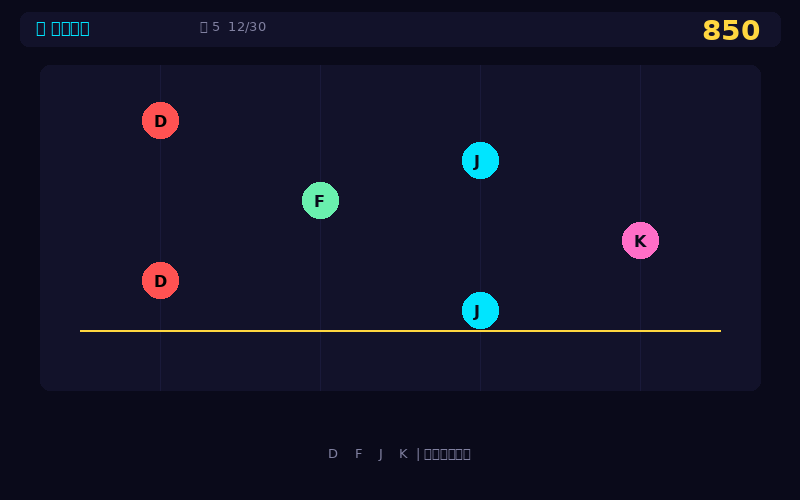
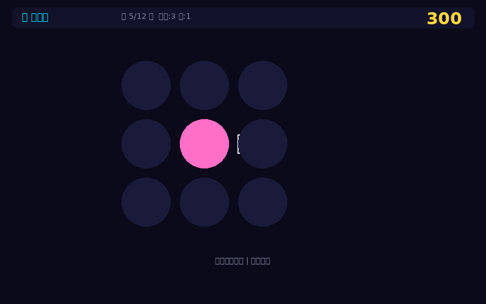
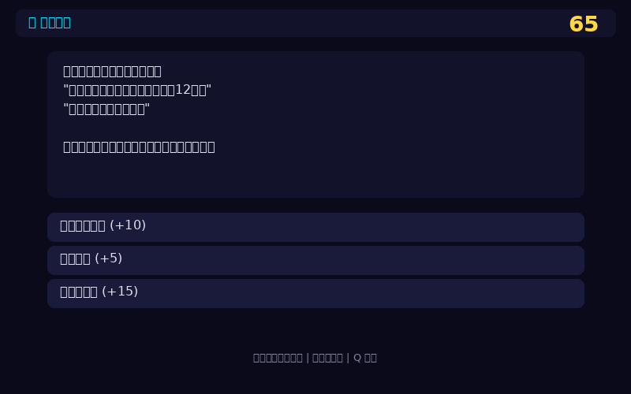
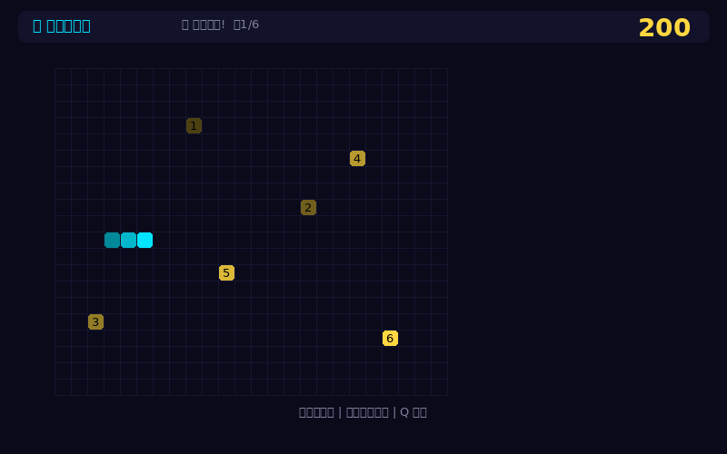
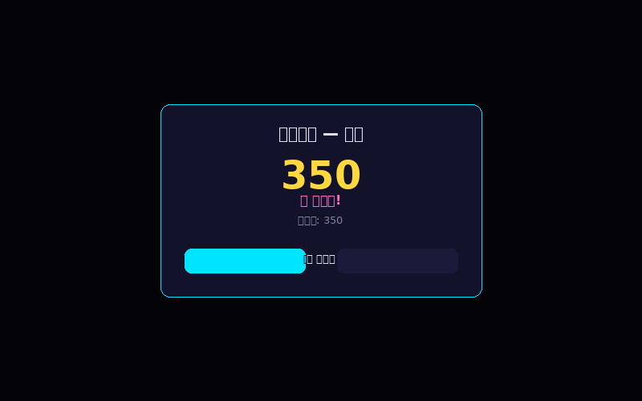

# Brain Games — 脑力训练合集

<p align="center">
  
</p>

## 简介

Brain Games 是一款脑力训练游戏合集，包含 **7 种不同类型的益智游戏**，专注于训练空间记忆、快速计算、逻辑推理、节奏感、反应速度、综合脑力和多任务处理能力。

- **Web 版**（v2.0）：HTML5 Canvas 图形界面，浏览器直接游玩，深色霓虹主题
- **终端版**（v1.0）：纯 CLI 体验，SSH 远程也可使用
- **零依赖**：仅使用 Python 标准库
- **跨平台**：支持 Linux / macOS / Windows (WSL)
- **三档难度**：简单 / 普通 / 困难，启动前可选

## 快速开始

```bash
# 浏览器版（Web GUI，推荐）
python3 main.py --web
# 或直接启动 Web 服务器
python3 web/server.py

# 终端版（CLI）
python3 main.py
```

浏览器会自动打开 `http://localhost:8686`，选择游戏和难度即可开始。

---

## 🎮 游戏详情

### 1. 记忆迷宫 — 空间记忆训练

<p align="center">
  
</p>

先观看完整迷宫布局（记忆阶段有倒计时），迷宫消失后凭记忆用方向键走出迷宫。考验空间想象力和短期记忆。

| 难度 | 迷宫大小 | 记忆时间 |
|------|---------|---------|
| 简单 | 11×11 | 4 秒 |
| 普通 | 17×17 | 5 秒 |
| 困难 | 23×23 | 6 秒 |

---

### 2. 弹幕大脑 — 快速计算+反应

<p align="center">
  
</p>

屏幕上方不断掉落带数字的弹幕，顶部显示一道数学题。移动角色触碰正确答案得分并累积连击，碰到错误答案扣命。绿色子弹是正确答案，红色是错误答案。

| 难度 | 生命 | 弹幕速度 |
|------|------|---------|
| 简单 | 3 | 慢 |
| 普通 | 2 | 中等 |
| 困难 | 1 | 快 |

**操作**: WASD / 方向键移动

---

### 3. 密码破译 — 逻辑推理挑战

<p align="center">
  
</p>

逐关破解凯撒密码加密的密文，在限定时间内输入正确答案。每关使用不同偏移量，可用提示查看偏移值。剩余时间越多得分越高。

| 难度 | 关卡数 | 时间/关 | 提示次数 |
|------|--------|---------|---------|
| 简单 | 5 | 45 秒 | 3 |
| 普通 | 7 | 30 秒 | 2 |
| 困难 | 10 | 20 秒 | 1 |

**操作**: 输入原文 + 回车提交

---

### 4. 节奏大师 — 节奏感训练

<p align="center">
  
</p>

音符从四条轨道落下，在判定线处按下对应按键。根据准确度判定为完美/良好/OK。连续命中累积 Combo，漏掉音符 Combo 中断。

| 难度 | 音符数 | 下落速度 |
|------|--------|---------|
| 简单 | 20 | 慢 |
| 普通 | 30 | 中等 |
| 困难 | 40 | 快 |

**操作**: D / F / J / K 四个按键

---

### 5. 打地鼠 — 反应速度训练

<p align="center">
  
</p>

3×3 九宫格中随机出现地鼠，鼠标点击命中得分，超时未点击则漏掉。统计命中率和反应速度。

| 难度 | 轮数 | 出现时间 |
|------|------|---------|
| 简单 | 12 | 1.2 秒 |
| 普通 | 18 | 1.0 秒 |
| 困难 | 25 | 0.8 秒 |

**操作**: 鼠标点击地鼠

---

### 6. 故事解谜 — 综合推理冒险

<p align="center">
  
</p>

文字冒险游戏，通过阅读场景描述和选择行动选项推进剧情。多个分支路径、物品收集、隐藏线索。不同选择导致不同结局，并影响最终得分。探索全面得分越高。

**操作**: 点击选项按钮

---

### 7. 贪吃蛇记忆 — 多任务处理

<p align="center">
  
</p>

经典贪吃蛇 + 记忆挑战。先观察所有苹果的位置和顺序（编号显示），记住后开始移动。必须按照 1→2→3→... 的顺序依次吃掉苹果，吃错顺序扣分。墙上/自身碰撞游戏结束。

| 难度 | 苹果数 |
|------|--------|
| 简单 | 4 |
| 普通 | 6 |
| 困难 | 8 |

**操作**: 方向键控制蛇

---

## 🏆 计分系统

<p align="center">
  
</p>

每个游戏独立计分，分数持久化保存在 `~/.brain-games/scores.json`。Web 版和终端版共享同一份分数文件。打破记录时弹窗提示"新纪录"。

## 项目结构

```
brain-games/
├── main.py                    # 终端入口（--web 启动 Web 版）
├── web/
│   ├── server.py              # Web 服务器（stdlib，零依赖）
│   └── static/
│       └── index.html         # SPA 前端（全部 7 个游戏）
├── src/
│   ├── engine/                # 游戏引擎核心（base/input/renderer/timer）
│   ├── games/                 # 7 个游戏终端版实现
│   ├── ui/                    # ANSI UI 组件
│   └── utils/                 # 工具（评分/迷宫/加密）
├── tests/                     # 19 个测试文件，82 项测试
├── docs/                      # 8 份项目文档
└── screenshots/               # 游戏截图
```

## 技术栈

- **后端**: Python 3.8+，纯标准库，零外部依赖
- **前端**: HTML5 Canvas + DOM，单页应用（SPA）
- **终端版**: ANSI 转义序列 + termios/msvcrt 输入
- **测试**: 82 项自动化测试，覆盖率 ~70%+

## 开发

```bash
# 运行全部测试
python3 run_all_tests.py

# 生成截图
python3 scripts/gen_screenshots.py
```

## 许可证

MIT License | Copyright (c) 2026 [WindRiders](https://github.com/WindRiders)